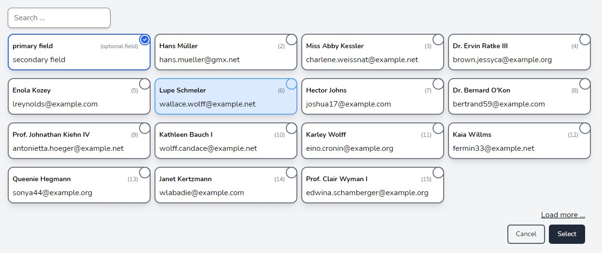

# TALL multiselect cards



*A TALL-based Laravel Livewire component to replace the (multiple) select HTML input form with beautiful cards.*

## Table of contents

* [1. Features](#1-features)
* [2. Usage](#2-usage)
  * [2.1 Livewire component](#21-livewire-component)
    * [2.1.1 Sample](#211-sample)
  * [2.2 Emitted event](#22-emitted-event)
    * [2.2.1 Sample event / implementation](#221-sample-event-implementation)
* [3. Installation](#3-installation)
  * [3.1 Views](#31-views)
  * [3.2 Language](#32-language)
* [4. Configuration](#4-configuration)
  * [4.1 Configuration values](#41-configuration-values)
* [5. Macros](#5-macros)
  * [5.1 query](#51-query)
  * [5.2 filter](#52-filter)
* [6. Tests](#6-tests)
* [7. Feedback / Support / Security](#7-feedback-support-security)
* [8. License](#8-license)

## 1. Features

* Easy to use replacement for `select multiple` HTML input elements.
* Cards which show up to 3 model attributes
* Optional: Search
* Optional: "Load more ..." (Eloquent pagination)

## 2. Usage

### 2.1 Livewire component

The package provides a Livewire component that you can use everywhere in your Laravel project - e.g. within modals, forms or landing pages.

#### 2.1.1 Sample

Add the component into your blade views like usual. 

```php
<div class="bg-gray-100">
  @livewire('tall-multiselect-cards', ['identifier' => 'User'])
</div>
```

Please take note that you'll need to determine which configuration the component should use by adding the necessary identifier parameter.

### 2.2 Emitted event

The component emits an event when a user clicks the `Save` button which allows you to interact with the component.

The emitted event name will be suffixed by the chosen `identifier` (see [Configuration values](#41-configuration-values) - [1]) to use the component multiple times (and perhaps at the same page).
It contains an array of the model IDs (value of the model attribute that you've configured to use as `uniqueId` attribute) that were selected by checking the cards.

#### 2.2.1 Sample event / implementation

* Event name: `tall-multiselect-cards-User`
* Event data: `[2, 4, 42]`

Note: When no cards are selected, the event will be emitted and contains an empty array.

Other components need to listen to the event and call a method to process it further.
When you're not familiar with event listening in Livewire, please take a look at the [offical Livewire documentation](https://laravel-livewire.com/docs/2.x/events#event-listeners).

Sample: Refactoring a Livewire component that accepted and processed form input using `wire:model="state.users"` before.

```php
class AwesomeForm extends Component
{
    public $state = [];
 
    protected $listeners = ['tall-multiselect-cards-User' => 'addSelectedUsers'];
 
    public function addSelectedUsers($value)
    {
        // Do whatever you want... validation, processing, etc...
        $this->state['users'] = $value;
    }
}
```

## 3. Installation

This package requires PHP 8.0, Laravel 8.0 and Livewire 2.5 or higher.

Installation via composer:

```bash
composer require codeadminde/tall-multiselect-cards
```

### 3.1 Views

The package provides pre-designed views that are prepared to use TailwindCSS (v2). 
To use these, please make sure you've already installed Tailwind CSS.
You'll find the official installation guide at https://tailwindcss.com/docs/guides/laravel

If you want to change/override the provided views, feel free to publish them via:

```bash
php artisan vendor:publish --tag=tall-multiselect-cards-views
```

You'll find the views in `resources/views/vendor/tall-multiselect-cards/` after publishing.

### 3.2 Language

The translation is provided via languages files for the following languages:

* English (en)
* German (de)

If you want to change/override the provided language files, feel free to publish them via:

```bash
php artisan vendor:publish --tag=tall-multiselect-cards-lang
```

You'll find the language files in `resources/lang/vendor/tall-multiselect-cards/` after publishing.

## 4. Configuration

The default configuration is prepared to use the package with Laravel's default User model.
If you want to change the default configuration, feel free to publish the configuration file via:

```bash
php artisan vendor:publish --tag=tall-multiselect-cards-config
```
You'll find the config file at `config/tall-multiselect-cards.php` after publishing.

### 4.1 Configuration values

The following default configuration will be shipped with the package.
You can use it directly with the Laravel default `User` model:

```php
    'User' => [ // [1]
        'model' => 'App\Models\User', // [2]
        'modelAttributes' => [  // [3]
            'uniqueId' => 'id', // unique model id (string)
            'primary' => 'name', // string OR NULL
            'secondary' => 'email',  // string OR NULL
            'optional' => NULL,  // string OR NULL
        ],
        'settings' => [ // [4]
            'paginate_data' => true, // [4.1] (boolean)
            'paginate_data_per_page' => 15, // [4.2] (integer)
            'enable_optional_brackets' => false, // [4.3] (boolean)
            'hide_search' => false, // [4.4] (boolean)
            'search_color_focus' => 'blue-400', // [4.5]
            'search_color_bg_focus' => 'blue-100', // [4.5]
            'card_color_bg' => 'white', // [4.5]
            'card_color_bg_hover' => 'blue-100', // [4.5]
            'card_color_bg_focus' => 'blue-100', // [4.5]
            'card_color' => 'gray-500', // [4.5]
            'card_color_selected' => 'blue-600', // [4.5]
            'card_color_hover' => 'blue-400', // [4.5]
            'card_color_focus' => 'blue-400', // [4.5]
            'primary_button_color_bg' => 'gray-800', // [4.5]
            'primary_button_color_bg_hover' => 'gray-700', // [4.5]
            'primary_button_color_bg_focus' => 'gray-700', // [4.5]
            'primary_button_color_text' => 'white', // [4.5]
            'primary_button_color_text_hover' => 'white', // [4.5]
            'primary_button_color_text_focus' => 'white', // [4.5]
            'secondary_button_color_border' => 'gray-600', // [4.5]
            'secondary_button_color_border_hover' => 'gray-400', // [4.5]
            'secondary_button_color_border_focus' => 'gray-400', // [4.5]
            'secondary_button_color_text' => 'gray-900', // [4.5]
            'secondary_button_color_text_hover' => 'gray-400', // [4.5]
            'secondary_button_color_text_focus' => 'gray-400', // [4.5]
        ]
    ],
```
* [1] Identifier: Provide a string that identifies the specific configuration / component. Note that this value should only contain [alpha_dash](https://laravel.com/docs/8.x/validation#rule-alpha-dash) chars.
* [2] `model`: FQCN of the model class that you want to use with the component.
* [3] `modelAttributes`: Model attributes that you want to display as card content. 
  * Important: `uniqueId` won't be shown as card content and need to be set to the attribute that contains the model ID (or UUID). That's usually the `id` column in your database. 
* [4] `settings`: Array of settings for the component.
  * [4.1] `paginate_data`: Enable or disable pagintion. 
    * Enabled: The component loads only the configured number ([4.2]) of models from the database. A "Load more ..." link will be shown to add the configured number ([4.2]) of models until all models are loaded.
    * Disabled: The component loads all models from the database at once.
  * [4.2] `paginate_data_per_page`: The amount of cards
    * that will be loaded initially and
    * that will be added when loading more models.
  * [4.3] `enable_optional_brackets`: Enable or disable brackets for the `optional` card position. You should disable this option when you set `attributes.optional` to NULL.
    * Enabled: The `optional` attribute value will be displayed within brackets.
    * Disabled: The `optional` attribute value will be displayed without brackets.
  * [4.4] `hide_search`: Enable or disable search input.
  * [4.5] `*_color_*`: Feel free to edit the color schema of the component. The configuration items were chosen self-explanatory to ensure easy styling. You can use every color that's provided by [TailwindCSS color palette](https://tailwindcss.com/docs/customizing-colors).

**All config values are required and need to return a string unless otherwise stated.**

## 5. Macros

The available macros allow you to manipulate the retrieved data. Just add them to the `boot` method of your applications ServiceProvider. (e.g. 'AppServiceProvider').

### 5.1 query

To extend / override the database query that loads the initial data, implement the `query` macro.

Sample:

```php
TallMultiselectCards::macro('query', function ($model, $selectedAttributes)
{
    return $model::select($selectedAttributes)->where('is_suspended', false);
});
```

### 5.2 filter

Implement the `filter` macro if you want to manipulate the collection returned by the database query.

```php
TallMultiselectCards::macro('filter', function ($collection)
{
    $filtered = $collection->filter(function ($item) {
        if (!$item->is_expired) {
            return $item;
        }
    });

    return $filtered;
});
```
**Note:** You should not manipulate the structure of the items themselves, as the collection will be processed further. Use the package without pagination, if you'll add/remove items from the collection at this point to avoid unexpected pagination results.

## 6. Tests

Please install the dev-dependencies first. Then you'll be able to run the tests via composer:

* Testing with testbench binary: `composer test`
* Testing with PHPUnit binary: `composer test-p`

## 7. Feedback / Support / Security

Please reach out to me at <gh-security@it-habich.de> for feedback or if you'll need support.

If you find security-related issues, please do not use the issue tracker instead, contact me via email.

## 8. License

The content of this repository is released under the [MIT license](LICENSE).

The `check-circle` SVG is licensed under the MIT license and provided by [tailwindlabs/heroicons](https://github.com/tailwindlabs/heroicons/blob/master/LICENSE). 
